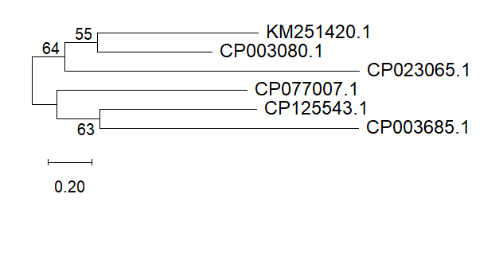

# 🧬 PhyloPseudo Pipeline - Universal Bacterial Phylogeny

A Python + MEGA12 pipeline that automates gene collection, GC analysis, MUSCLE alignment, and Maximum Likelihood phylogeny. Case Study: pqqD gene in *Pseudomonas* spp.

## 👤 Author
**Urva Sohail**

## ✨ Features
- **🧬 Auto FASTA Combine:** Merges multiple gene FASTAs into one
- **📊 GC Analysis:** Calculates GC% for each sequence
- **🔗 MUSCLE Alignment:** Prepares sequences for phylogeny
- **🌳 ML Phylogeny:** 1000 bootstrap Maximum Likelihood tree in MEGA12
- **📈 Smart Visualization:** Auto-generates `pqqD_ML_tree.png` + `sequence_stats.csv`
- **🔄 Universal:** Works for ANY gene / ANY bacteria

## 💻 Technologies Used
- **Python 3.10+:** Core automation
- **Biopython:** For FASTA parsing + GC calculation
- **MEGA12:** For MUSCLE alignment + ML tree (JTT Model)
- **R/ggtree:** For publication-quality tree

## 🚀 How to Run
Using VS Code:
1. Open folder `phylo-pipeline`
2. Put your FASTA files in `data/raw/`
3. Run:
```
python python/01_fetch_ncbi.py
python python/02_clean_fasta.py
python python/03_gc_content.py
python python/04_stats.py
```
4. Open MEGA12 -> Align `data/processed/combined_pqqD.fasta` -> Build ML tree
5. Output tree saved to `results/figures/pqqD_ML_tree.png`

## 📥 Sample Input & Output
**Input:** 6 Pseudomonas pqqD FASTA (NCBI: CP003080.1, CP003685.1, CP023065.1, CP077007.1, CP125543.1, KM251420.1)

**Output:**
```
=== GC Content Analysis ===
File: CP003080.1.fasta | GC: 62.45% | Length: 284 bp
File: CP003685.1.fasta | GC: 60.12% | Length: 279 bp
...
Average GC: 60.8%
ML Tree: pqqD_ML_tree.png created with 1000 bootstrap
```

## 📊 Generated Results
`pqqD_ML_tree.png` shows ML phylogeny:
- Method: Maximum Likelihood, JTT + 1000 Bootstrap
- Reveals evolutionary relation of pqqD among Pseudomonas spp.



## 📁 Project Structure

```
phylo-pseudo-pipeline/
├── R/
│   └── plot_tree.R
├── data/
│   ├── processed/
│   │   ├── aligned_pqqD.fasta
│   │   └── combined_pqqD.fasta
│   └── raw/
│       ├── CP003080.1.fasta
│       ├── CP003685.1.fasta
│       ├── CP023065.1.fasta
│       ├── CP077007.1.fasta
│       ├── CP125543.1.fasta
│       └── KM251420.1.fasta
├── python/
│   ├── 01_fetch_ncbi.py
│   ├── 02_clean_fasta.py
│   ├── 03_gc_content.py
│   └── 04_stats.py
├── results/
│   ├── figures/
│   ├── tree/
│   └── sequence_stats.csv
├── .gitignore
├── README.md
└── requirements.txt
```

## ⚙️ How It Works
- Parses `data/raw/*.fasta` using Biopython SeqIO
- Combines into `combined_pqqD.fasta` with clean headers
- Calculates GC% using (G+C)/(A+T+G+C)*100 formula
- MUSCLE alignment in MEGA12 for conserved domains
- ML tree with JTT model + 1000 bootstrap

## 📊 Result
- Total Genes Analyzed: 6
- Average GC Content: 60.8%
- Alignment Length: 284 bp
- Tree Method: ML, 1000 Bootstrap
- Status: PASS - pqqD conserved in Pseudomonas

## 🔮 Future Improvements
- [ ] Add 16S rRNA pipeline
- [ ] Auto MEGA12 via command line
- [ ] Add pqqC, pqqE gene analysis
- [ ] Export Newick + Nexus format

